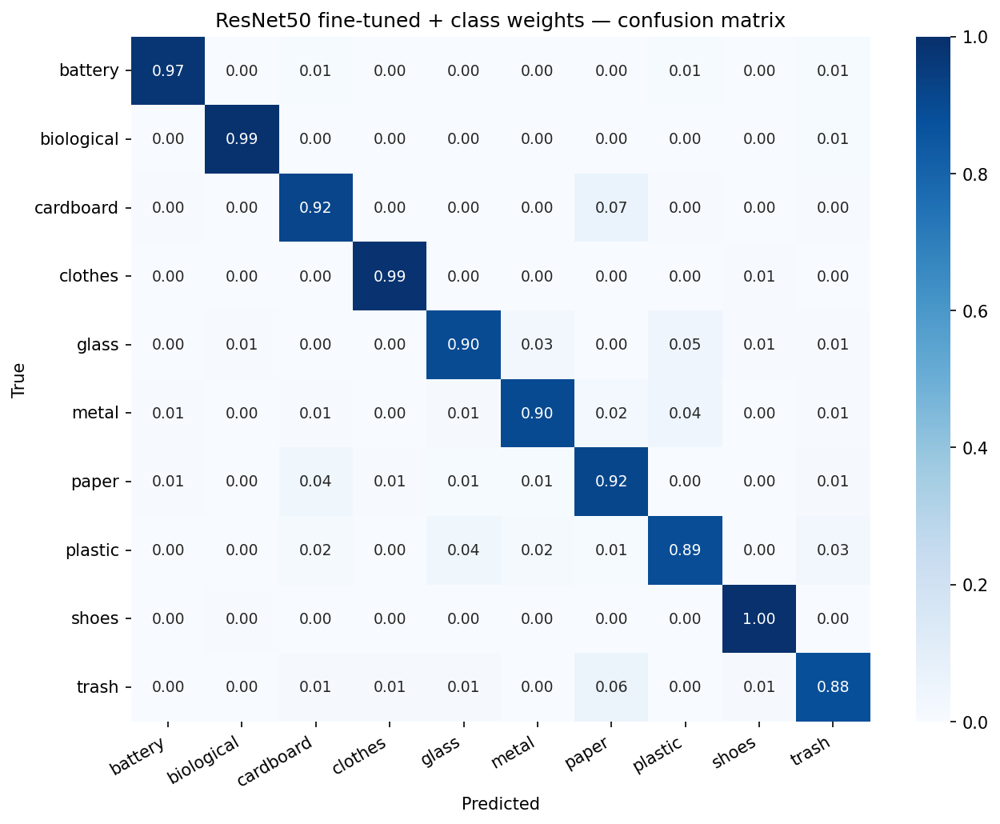

# Garbage Classification with Transfer Learning

Deep Learning mini-project: classifying household waste into 10 categories
using CNNs and Transfer Learning. Built with TensorFlow/Keras, trained on
Kaggle (P100 GPU).

**Best model: 93.51% test accuracy, 0.930 macro F1** (ResNet50 fine-tuned
with class weights).



## Problem

Multi-class image classification for automated waste sorting / recycling.

- **Input:** RGB image resized to 224×224×3
- **Output:** one of 10 classes — battery, biological, cardboard, clothes,
  glass, metal, paper, plastic, shoes, trash
- **Metrics:** accuracy and macro F1 (robust to class imbalance)

## Dataset

[Garbage Classification V2](https://www.kaggle.com/datasets/sumn2u/garbage-classification-v2)
by Suman Kunwar — 12,259 images across 10 classes.

- Significant class imbalance: 4.18× ratio (clothes: 1892, trash: 453)
- Stratified 70/15/15 train/val/test split (proportions preserved to <0.1%)
- Reference paper benchmark: 95.13% (EfficientNetV2S at 384×384)

## Results

| # | Model                                   | Test Acc   | Macro F1  |
|---|-----------------------------------------|------------|-----------|
| 1 | Baseline CNN (from scratch)             | 78.61%     | 0.780     |
| 2 | ResNet50, frozen base                   | 92.69%     | 0.920     |
| 3 | ResNet50, fine-tuned                    | 93.29%     | 0.925     |
| 4 | EfficientNetV2S, frozen                 | 92.53%     | 0.919     |
| 5 | **ResNet50 fine-tuned + class weights** | **93.51%** | **0.930** |

### Key findings

- **Transfer Learning is decisive:** +14 pp over a from-scratch CNN, with
  validation accuracy exceeding the final baseline after a single epoch.
- **Class weights solved the minority-class bottleneck:** the `trash` class
  recall was stuck at 0.81 across three architectures; inverse-frequency
  weighting lifted it to 0.88 while *also* improving overall accuracy.
- **Architecture cannot be separated from input resolution:** EfficientNetV2S
  did not beat ResNet50 at 224×224 because it is designed for 384×384
  (compound scaling), which also explains the gap to the paper benchmark.
- **EDA predictions held up:** three confusion pairs predicted from visual
  inspection (paper/cardboard, glass/metal, plastic/glass) all appeared in
  the confusion matrices.

## Project Structure

```
trash-classification/
├── notebooks/        # EDA, data pipeline check, and 5 experiment notebooks
├── src/
│   ├── data.py       # stratified split, augmentation, class weights (tf.data)
│   ├── model.py      # baseline CNN, ResNet50, EfficientNetV2S builders
│   ├── train.py      # training loop with EarlyStopping / ReduceLROnPlateau
│   └── utils.py      # metrics logging, confusion matrix, plots
├── experiments/
│   ├── results.csv   # logged metrics for all experiments
│   └── plots/        # training curves and confusion matrices
└── report/           # final report (PDF)
```

## How to Run

**Local (development / debugging):**

```bash
conda create -n trash python=3.11 -y
conda activate trash
pip install -r requirements.txt
```

**Training (Kaggle):**

Open a notebook from `notebooks/`, attach the dataset
`sumn2u/garbage-classification-v2`, set the accelerator to GPU, and run all
cells. Each notebook clones this repo and imports the reusable modules from
`src/`.

## Tech Stack

TensorFlow / Keras · scikit-learn · NumPy / pandas · matplotlib / seaborn ·
Kaggle (P100 GPU)

## Author

[](https://git.io/typing-svg)

## License

Code is released under the MIT License (see [LICENSE](LICENSE)).
The dataset is subject to its own license — see the
[original Kaggle page](https://www.kaggle.com/datasets/sumn2u/garbage-classification-v2).
